# MAC强化学习环境搭建

## 1. Anaconda
### 1. 安装
Anaconda是一个Python集成环境，product ready，包含了各种常用python组件库（web，科学计算，数据分析，画图，等等）[官网](https://www.continuum.io)

**推荐通过brew安装**
`brew cask install anaconda`

****

### 2. 配置
安装完成后可以通过Anaconda-Navigator或命令行conda进行环境配置。本章主演演示Anaconda-Navigator图形化界面配置
#### 2.1 虚拟环境配置
推荐创建新虚拟环境，在新虚拟环境下工作不会污染全局环境（下图展示root环境及用户新创建的ml虚拟环境）
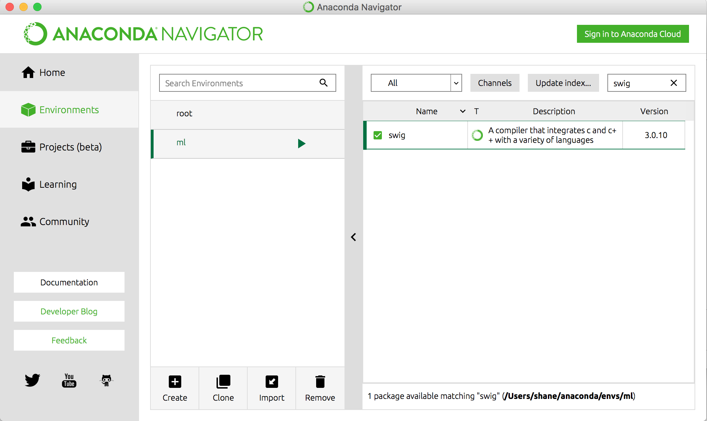
#### 2.2 镜像配置
1. 在Anaconda-Navigator -> Environments -> 选中要配置的环境
2. 进入Channels配置，添加镜像地址 [清华大学镜像](https://mirrors.tuna.tsinghua.edu.cn/help/anaconda/)
3. 确定，点击Update channels
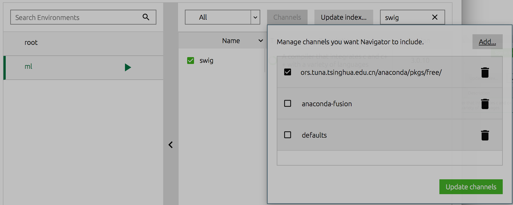

## 2. Pycharm
### 1. 安装
Pycharm绝对最好用的Python IDE [官网](http://www.jetbrains.com/pycharm/)

**推荐通过brew安装**
`brew cask install pycharm`

****

### 2. 配置
Pycharm拥有丰富的配置，主要通过两种渠道来设置，1. 全局默认配置， 2. 当前工作空间配置。本章配置主要针对全局默认配置Project Interpreter（Python运行环境）
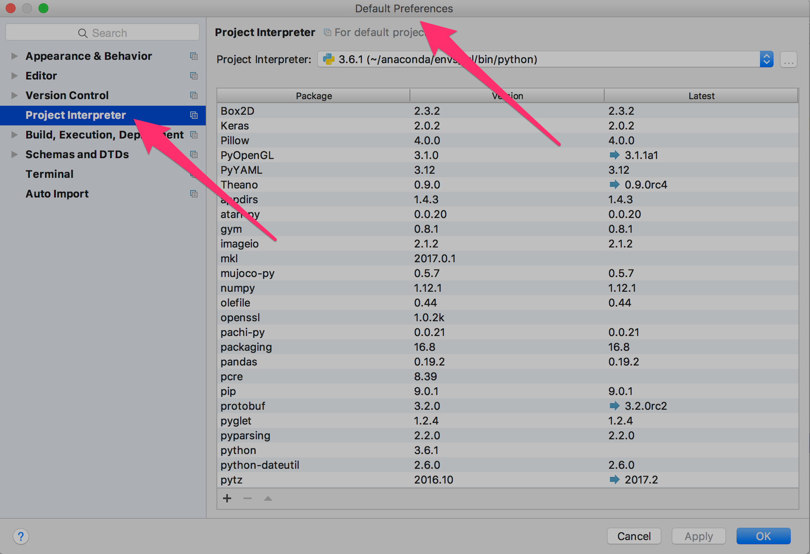
#### 2.1 Interpreter配置
Project Interpreter默认会找到系统中所有的Python环境及虚拟环境（包括Anaconda环境），如果没有探查到你所需要的环境，也可以通过手动的方式添加。
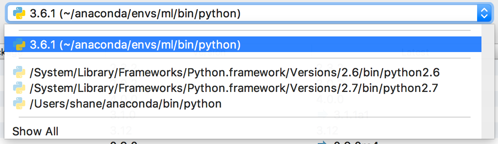
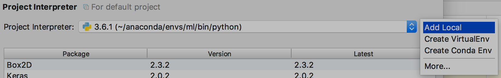
#### 2.2 镜像配置
Pycharm中也可以添加[Pip镜像](https://mirrors.tuna.tsinghua.edu.cn/help/pypi/)和[Anaconda镜像](https://mirrors.tuna.tsinghua.edu.cn/help/anaconda/),一般根据当前环境是Python Virual Env还是Conda Env添加不同的镜像
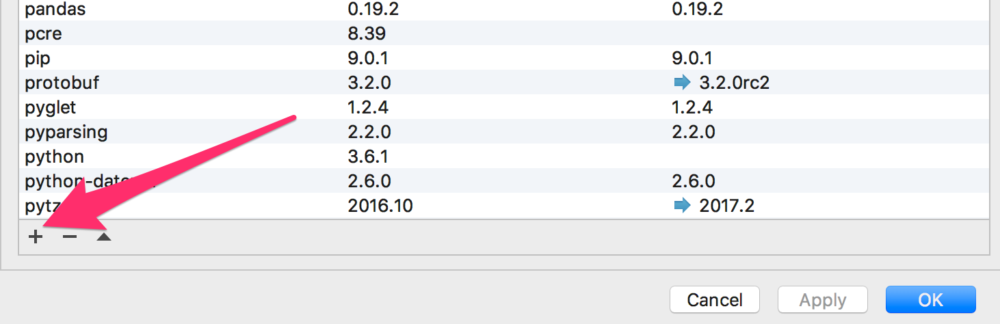
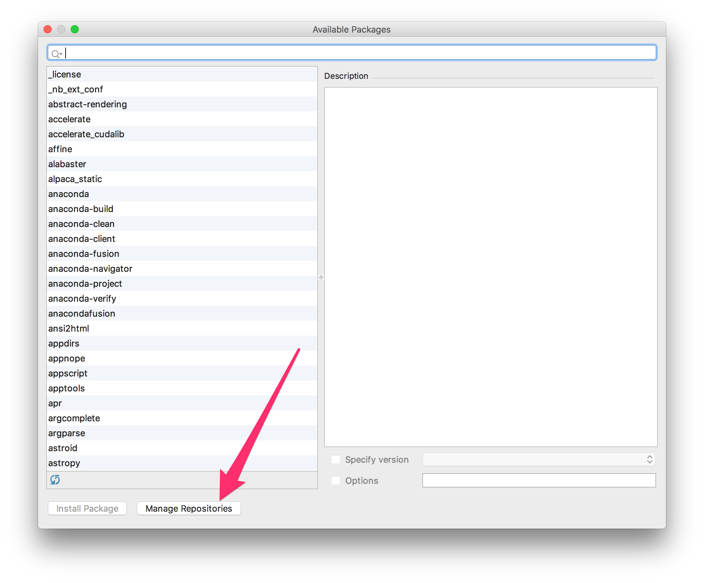
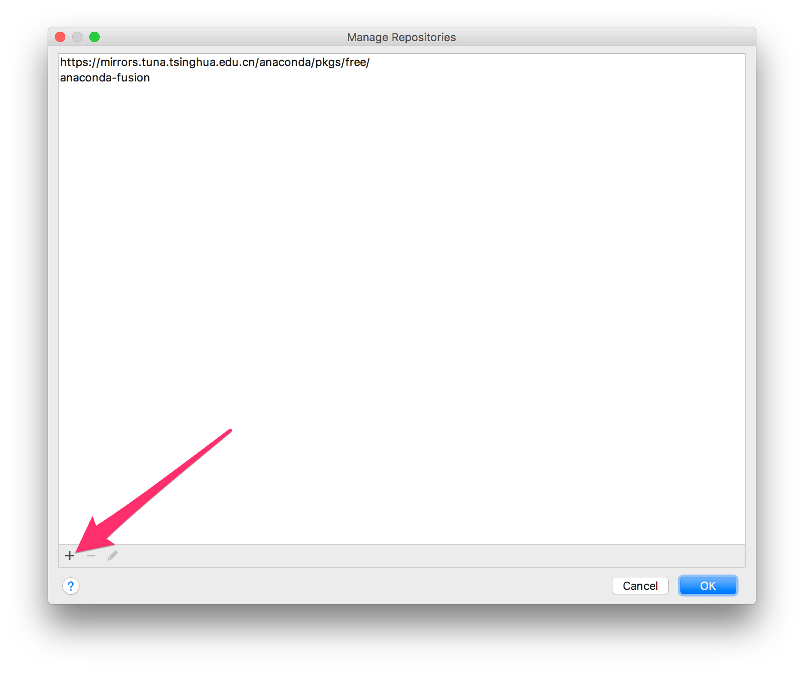

## 3. Tensorflow
Tensorflow是google的机器学习Python框架，大有一统江湖的趋势，有CPU和GPU版本，GPU版本只支持NVIDIA的CUDA显卡，我的MBP采用的不是N卡，故只能装CPU版本
### 1. 安装
目前conda库中没有tensorflow，所以还是要通过pip安装

1. 在pycharm中打开terminal
2. 确认当前环境是对的
3. 输入命令安装tensorflow（这里用了清华镜像）
`pip install -i https://pypi.tuna.tsinghua.edu.cn/simple tensorflow`
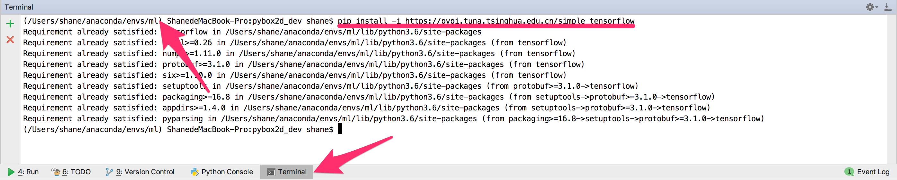

## 4. OpenAI Gym
OpenAI Gym是马斯克旗下的一款深度学习训练环境的Python框架，其中包含大量类游戏环境（Atari等）用来进行深度学习（强化学习）的AI训练。这次安装gym及其下所有环境时遇到一些坑，写下来方便以后查阅
### 1. 安装 cmake
OpenAI Gym 的一些环境是依赖cmake的，如果没有cmake，安装gym[all]时是会报错的。

mac下安装cmake是很简单的 `brew install cmake`

### 2. 安装 swig
swig是另一个坑，没有swig的话，gym安装也是会报错的

1. 在pycharm中打开terminal
2. 确认当前环境是对的
3. 输入命令安装swig
`conda install -c https://mirrors.tuna.tsinghua.edu.cn/anaconda/pkgs/free/ swig`
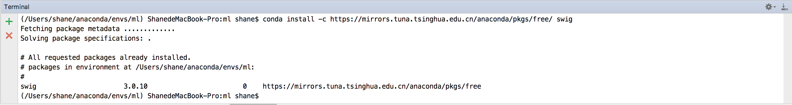

### 3. 安装 gym[all]
目前conda库中也没有gym，所以也还是要通过pip安装

1. 在pycharm中打开terminal
2. 确认当前环境是对的
3. 输入命令安装OpenAI Gym（这里用了清华镜像）
`pip install -i https://pypi.tuna.tsinghua.edu.cn/simple gym[all]`
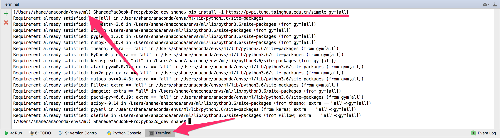

### 4. 解决 '_Box2D' has no attribute 'RAND_LIMIT_swigconstant'
[解决方案](https://github.com/openai/gym/issues/100)

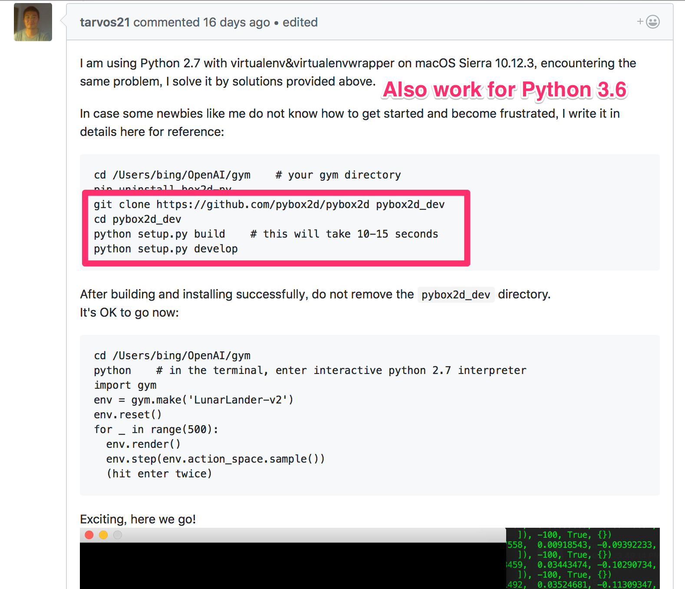
